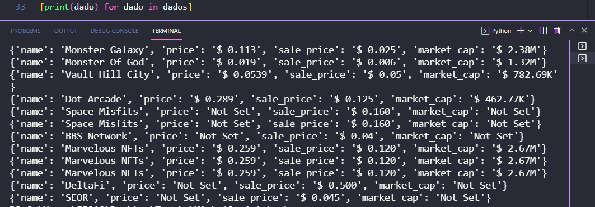

## A receita do bolo

* Achar a URL de onde você quer retirar informação
* Inspecionar a página
* Achar dentro da página os dados que você quer extrair. (Pesquise por Xpath e tags html)
* Escreva o código que automatiza esse processo
* Armazene os dados no formato desejado :D

## Exemplo de saida


## Gostei, como faz?
```bash
# Clonar o repositorio
git clone https://github.com/Mesheo/Biblioteca-API.git && cd Biblioteca-API

# Criar ambiente Virtual 
python -m venv venv && ./venv/Scripts/Activate.ps1

# Instalar dependencias
pip install -r requirements.txt

# Seja feliz 
python nome_do_arquivo.py 
```